# 🏎️ F1 Pit Wall Dashboard


* **Core Language:** 
* **Libraries & Frameworks:**   
* **Engineering Concepts:**  

F1 Pit Wall Dashboard is a data-driven Streamlit application for Formula 1 race analysis, integrating real-world telemetry using FastF1, tyre degradation analysis, and digital communication simulations. 

🔗 **[Live Demo: Play with the Dashboard here](https://f1pitwalldashboard.streamlit.app/)**

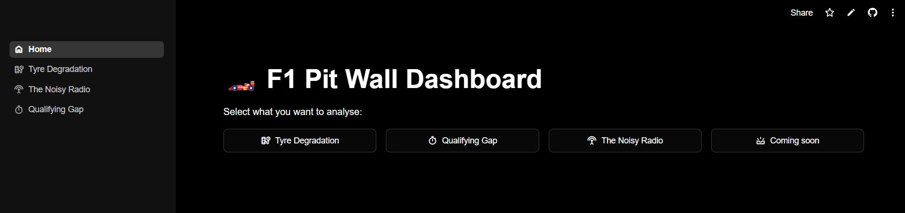
<p align="center"><sub>Fig. 1: A full overview of the F1 Pit Wall Dashboard interface.</sub></p>

---

## 🛠️ Modules Overview

### 1. 🛞 Tyre Degradation (Race & Sprint)
Estimates tyre degradation by analyzing stint pace, correcting raw lap times with a customizable fuel effect coefficient.
* Filters out in-laps, out-laps, anomalous track conditions (Safety Car, VSC) or very slow laps. It only keeps laps where the track is clear.
* Only considers stints with a minimum number of laps.
* Plots a linear regression for each stint to calculate degradation in seconds/lap.
* Slider to choose how much faster the car goes per every lap thanks to fuel consumption.

#### 📐 Formulas 
**Fuel correction:**
To isolate pure tyre drop-off, lap times are adjusted to account for the car getting lighter considering a fuel effect. A standard F1 rule of thumb states that 10 kg of fuel weight costs ~0.3 seconds per lap. 
So, assuming an average fuel consumption of 1.5 - 2.0 kg per lap, the car naturally gains roughly 0.05 to 0.06 seconds per lap purely from weight reduction. 
To neutralize this weight advantage and observe the true tyre performance, you add this time back to the raw lap times:
$$\text{Corrected Time} = \text{Raw Lap Time} + (\text{Fuel Effect} \times \text{Lap Number})$$

#### ⚠️ Known Limitations
* **Starting Fuel Load:** The exact starting fuel weight is kept secret by the teams. The fuel effect is a linear estimation.
* **Traffic & Dirty Air:** The degradation model currently does not account for time lost behind lapped cars or the aerodynamic penalty of dirty air.
* **Track Evolution:** Rubbering-in effect during the session is not mathematically isolated from tyre degradation.

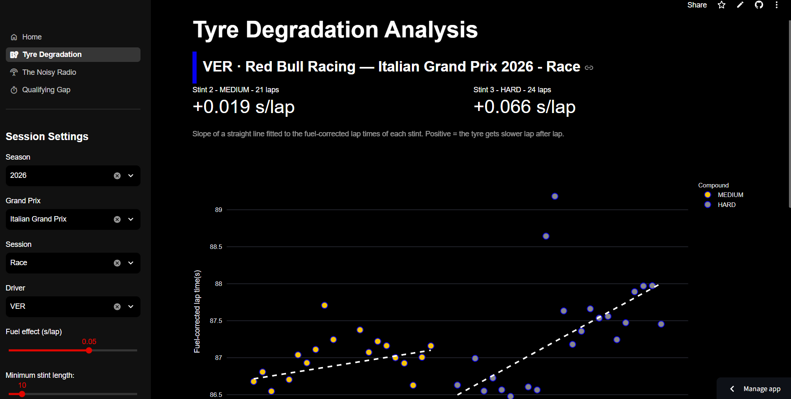
<p align="center"><sub>Fig. 2: Linear regression modeling of tyre drop-off across different stints.</sub></p>

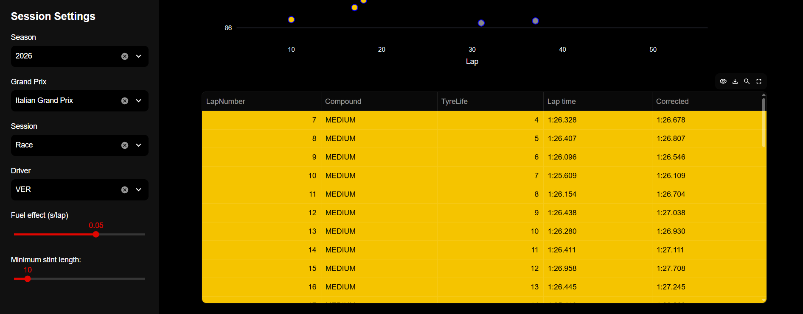
<p align="center"><sub>Fig. 3: Lap Time Table with real lap time, corrected time, tyre life and used compounds.</sub></p>

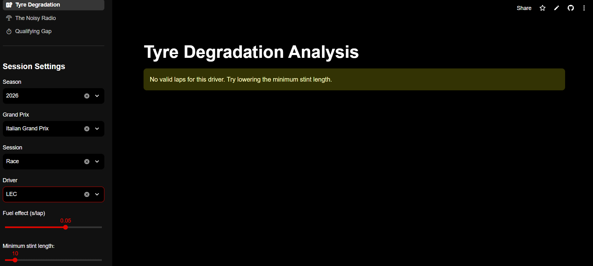
<p align="center"><sub>Fig. 4: Filtering process removing in-laps, out-laps, and SC periods to isolate valid racing conditions. Example with a crash in lap 2.</sub></p>
  
### 2. ⏱️ Qualifying Gap
An interactive horizontal bar chart that visualizes the qualifying pace. 
* Automatically extracts the fastest valid lap for each driver.
* Calculates dynamic time deltas (gap to pole, gap to the preceding driver, and gap to the following driver).
* Styled with official F1 team colors for immediate readability.

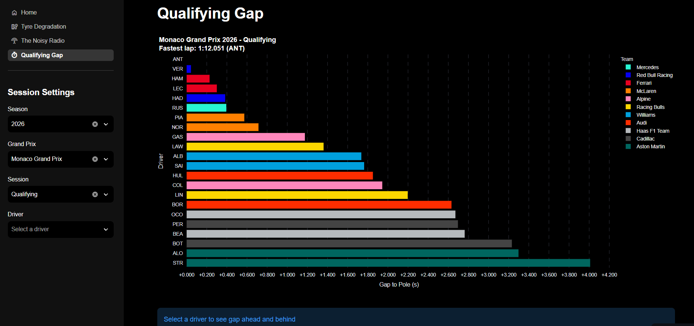
<p align="center"><sub>Fig. 5: Horizontal bar chart displaying qualifying gaps relative to the pole sitter.</sub></p>

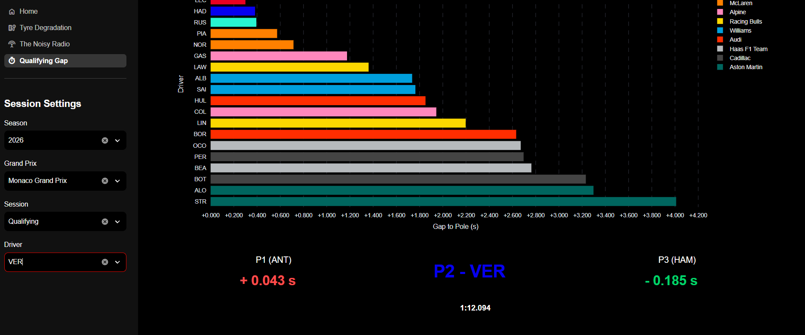
<p align="center"><sub>Fig. 6: Dynamic time deltas showing the exact gap to the preceding and following drivers.</sub></p>

### 3. 📡 The Noisy Radio (Digital Communication System)
A simulation of how F1 car telemetry travels from the car to the pit wall, applying concepts from telecommunications engineering.
* Takes a real, high-frequency telemetry signal (speed).
* Applies ideal sampling and uniform quantization.
* Simulates an AWGN (Additive White Gaussian Noise) non-distorting channel mapping bits into an M-PAM constellation.
* Reconstructs the signal to observe the final MSE and Bit Error Rate (BER).
* It shows lecture notes.

#### 📐 Formulas
* The continuous speed signal is quantized into $L = 2^b$ levels.
* The theoretical Mean Squared Error (MSE) for the uniform quantizer is: 
$$\text{MSE} = \frac{\Delta^2}{12}$$
Where $\Delta$ is the quantization step.
* The bits are then mapped using a Gray-coded M-PAM constellation, and noise is added based on the selected $E_b/N_0$ (dB) ratio. 

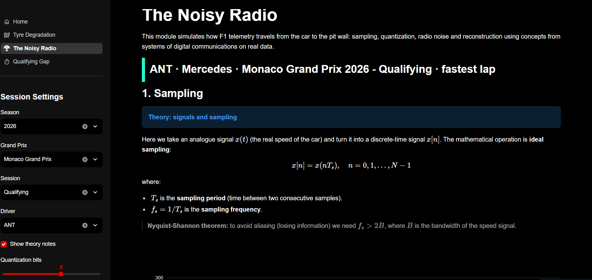
<p align="center"><sub>Fig. 7: Theory notes explaining the ideal sampling of the continuous speed signal.</sub></p>

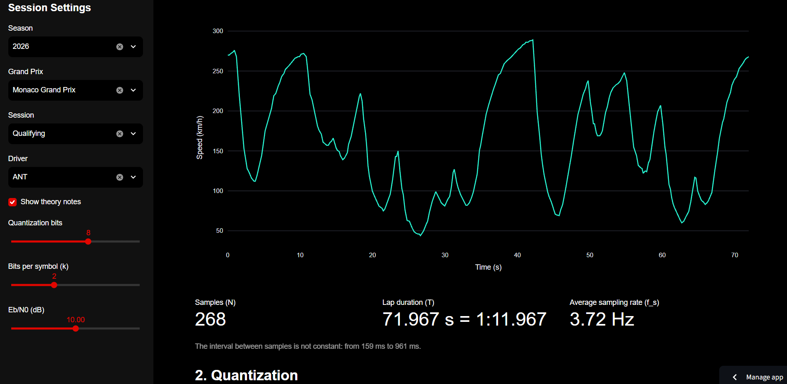
<p align="center"><sub>Fig. 8: Visualization of the sampled telemetry signal.</sub></p>

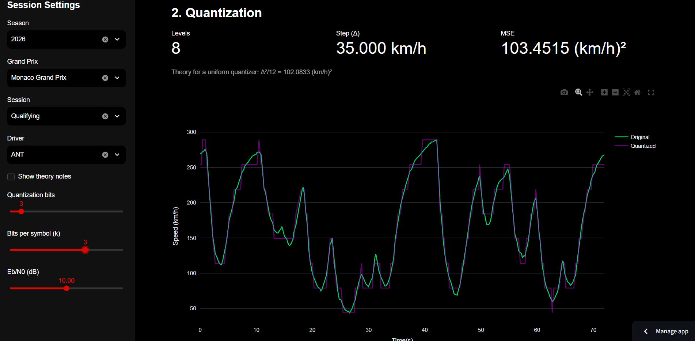
<p align="center"><sub>Fig. 9: Uniform quantization applied to the speed data.</sub></p>

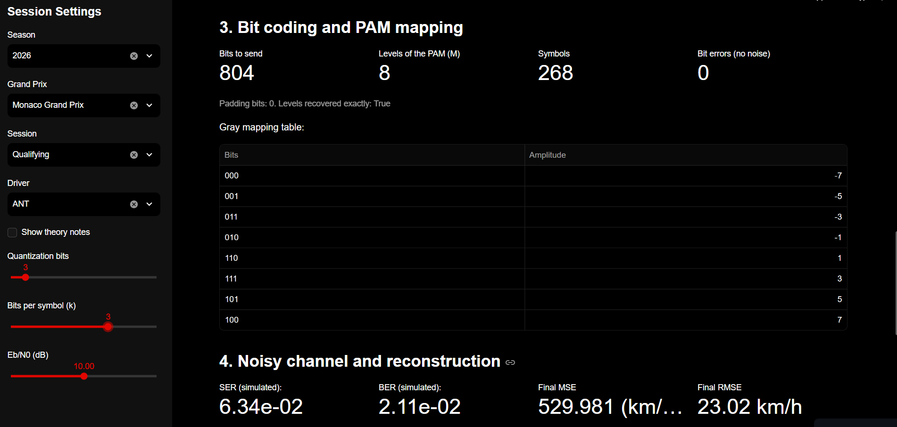
<p align="center"><sub>Fig. 10: Gray-coded mapping table for the M-PAM constellation.</sub></p>

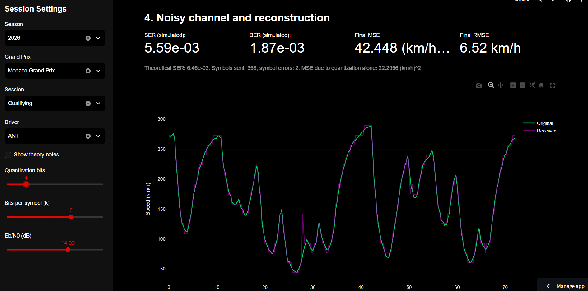
<p align="center"><sub>Fig. 11: Reconstructed signal comparison against the original, highlighting the final MSE and BER after AWGN channel transmission.</sub></p>

---
## 🔮 Future Developments
* **Race Strategy Simulator**
* **Noisy Radio — Level B:** compare bandpass PAM and QAM constellations, plot simulated vs. theoretical SER curves, and derive the required $E_b/N_0$ for a target SER to compare spectral and energy efficiency across modulation schemes.

---

## 💻 Tech Stack
* **Python 3**
* **Streamlit** (UI and Web Deployment)
* **FastF1** (F1 API Data Extraction)
* **Pandas & NumPy** (Data Manipulation & Grouping)
* **SciPy** (Signal Processing & Error Functions)
* **Plotly** (Interactive Data Visualization)

---

## 🚀 How to Run Locally

1. Clone this repository:
   ```bash
   git clone https://github.com/dlcbeatrix/f1_pitwall.git
   cd f1_pitwall
2. Create and activate a virtual environment:

   ```bash

   python -m venv venv

   venv\Scripts\activate

3. Install the dependencies:

   ```bash

   pip install -r requirements.txt

4. Run the Streamlit app: 

    ```bash

    streamlit run app.py


---

## 👤 Author

Developed by **dlcbeatrix**, Beatrice De Luca, *Computer Engineering Student*. 

