# 🏎️ F1 Pit Wall Dashboard


* **Core Language:** 
* **Libraries & Frameworks:**   
* **Engineering Concepts:**  

F1 Pit Wall Dashboard is a data-driven Streamlit application for Formula 1 race analysis, integrating real-world telemetry using FastF1, tyre degradation analysis, and digital communication simulations. 

🔗 **[Live Demo: Play with the Dashboard here](https://f1pitwalldashboard.streamlit.app/)**

**⚠️ Known Limitations**

>F1's live-timing servers block requests from cloud hosting IPs (including Streamlit Community 
Cloud). The live demo ships with a curated set of pre-downloaded sessions (full list [here](docs/pre_downloaded_sessions.md)); 
selecting a session or driver telemetry outside that set will fail to download when running 
in the cloud (it works fine locally).


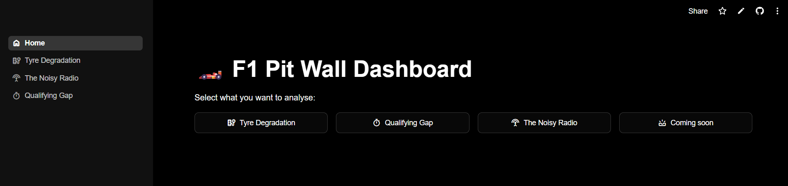
<p align="center"><sub>Fig. 1: A full overview of the F1 Pit Wall Dashboard interface.</sub></p>

---

## 🛠️ Modules Overview

### 1. 🛞 Tyre Degradation (Race & Sprint)
Estimates tyre degradation by analyzing stint pace, correcting raw lap times with a customizable fuel effect coefficient.
* Filters out in-laps, out-laps, anomalous track conditions (Safety Car, VSC) or very slow laps. It only keeps laps where the track is clear.
* Only considers stints with a minimum number of laps.
* Plots a linear regression for each stint to calculate degradation in seconds/lap.
* Slider to choose how much faster the car goes per every lap thanks to fuel consumption.

#### 📐 Formulas 
**Fuel correction:**
To isolate pure tyre drop-off, lap times are adjusted to account for the car getting lighter considering a fuel effect. A standard F1 rule of thumb states that 10 kg of fuel weight costs ~0.3 seconds per lap. 
So, assuming an average fuel consumption of 1.5 - 2.0 kg per lap, the car naturally gains roughly 0.05 to 0.06 seconds per lap purely from weight reduction. 
To neutralize this weight advantage and observe the true tyre performance, you add this time back to the raw lap times:
$$\text{Corrected Time} = \text{Raw Lap Time} + (\text{Fuel Effect} \times \text{Lap Number})$$

#### ⚠️ Known Limitations
* **Starting Fuel Load:** The exact starting fuel weight is kept secret by the teams. The fuel effect is a linear estimation.
* **Traffic & Dirty Air:** The degradation model currently does not account for time lost behind lapped cars or the aerodynamic penalty of dirty air.
* **Track Evolution:** Rubbering-in effect during the session is not mathematically isolated from tyre degradation.

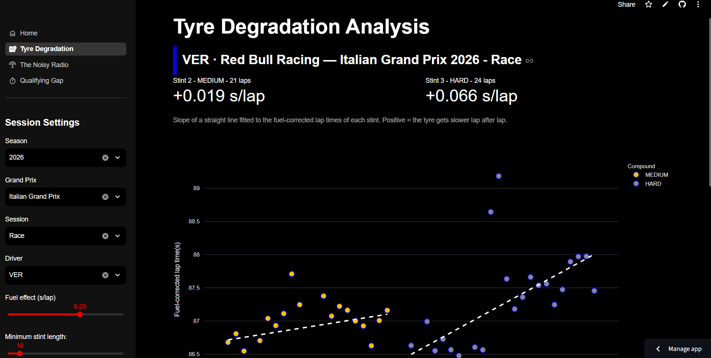
<p align="center"><sub>Fig. 2: Linear regression modeling of tyre drop-off across different stints.</sub></p>

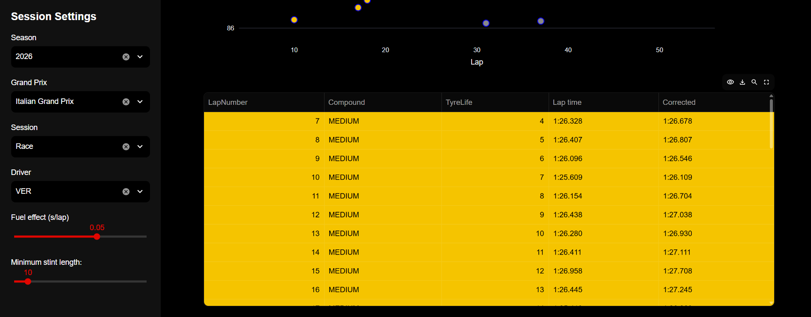
<p align="center"><sub>Fig. 3: Lap Time Table with real lap time, corrected time, tyre life and used compounds.</sub></p>

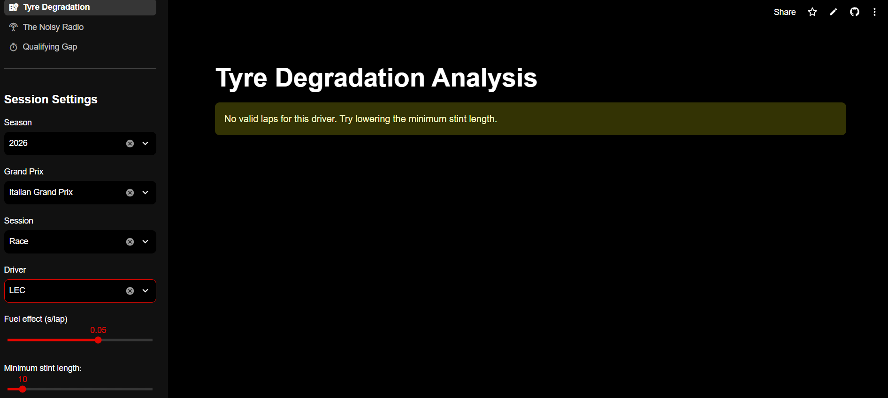
<p align="center"><sub>Fig. 4: Filtering process removing in-laps, out-laps, and SC periods to isolate valid racing conditions. Example with a crash in lap 2.</sub></p>
  
### 2. ⏱️ Qualifying Gap
An interactive horizontal bar chart that visualizes the qualifying pace. 
* Automatically extracts the fastest valid lap for each driver.
* Calculates dynamic time deltas (gap to pole, gap to the preceding driver, and gap to the following driver).
* Styled with official F1 team colors for immediate readability.

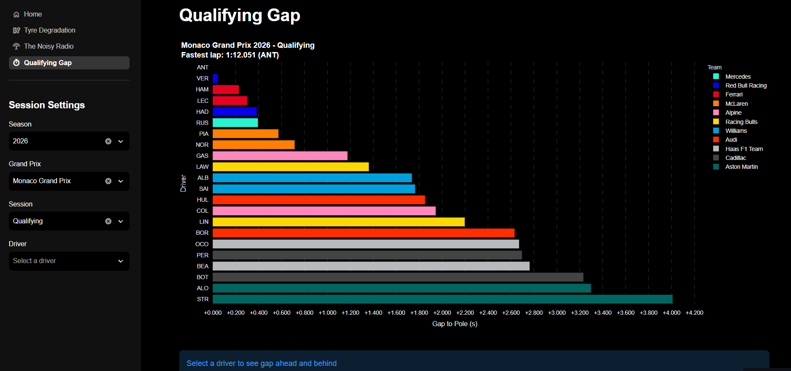
<p align="center"><sub>Fig. 5: Horizontal bar chart displaying qualifying gaps relative to the pole sitter.</sub></p>

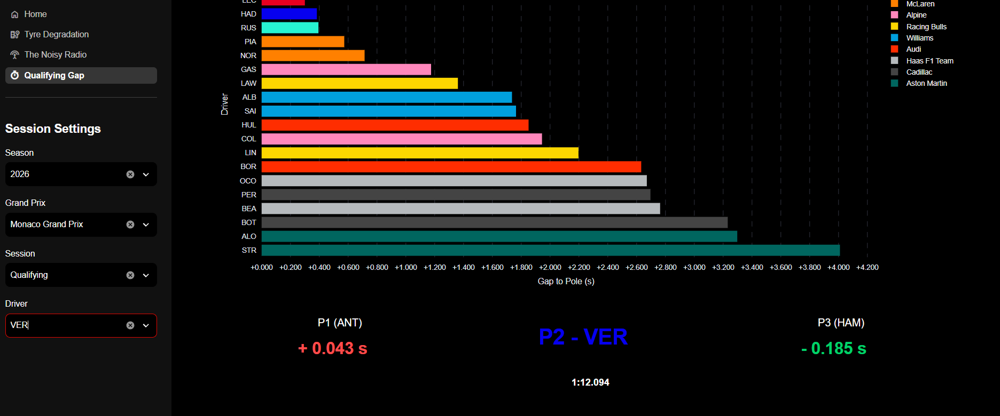
<p align="center"><sub>Fig. 6: Dynamic time deltas showing the exact gap to the preceding and following drivers.</sub></p>

### 3. 📡 The Noisy Radio (Digital Communication System)
A simulation of how F1 car telemetry travels from the car to the pit wall, applying concepts from telecommunications engineering.
* Takes a real, high-frequency telemetry signal (speed).
* Applies ideal sampling and uniform quantization.
* Simulates an AWGN (Additive White Gaussian Noise) non-distorting channel mapping bits into an M-PAM constellation.
* Reconstructs the signal to observe the final MSE and Bit Error Rate (BER).
* It shows lecture notes.

#### 📐 Formulas
* The continuous speed signal is quantized into $L = 2^b$ levels.
* The theoretical Mean Squared Error (MSE) for the uniform quantizer is: 
$$\text{MSE} = \frac{\Delta^2}{12}$$
Where $\Delta$ is the quantization step.
* The bits are then mapped using a Gray-coded M-PAM constellation, and noise is added based on the selected $E_b/N_0$ (dB) ratio. 

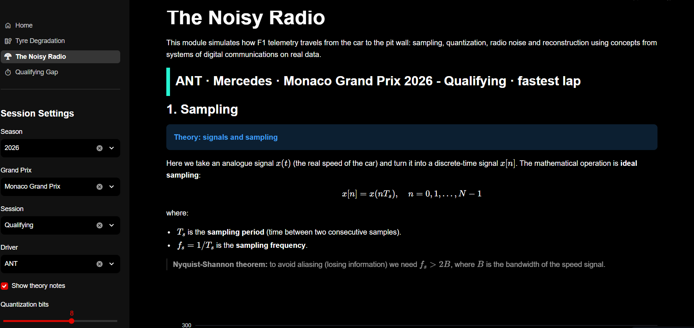
<p align="center"><sub>Fig. 7: Theory notes explaining the ideal sampling of the continuous speed signal.</sub></p>

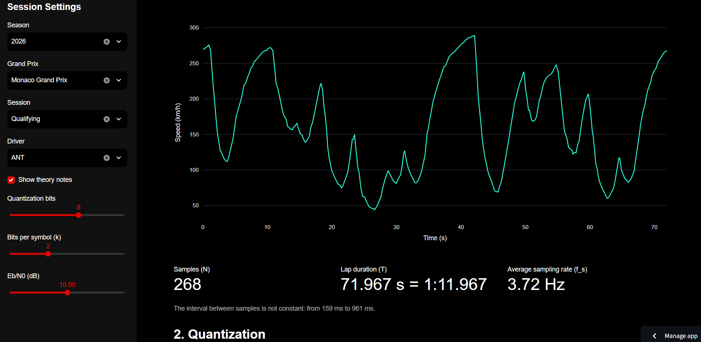
<p align="center"><sub>Fig. 8: Visualization of the sampled telemetry signal.</sub></p>

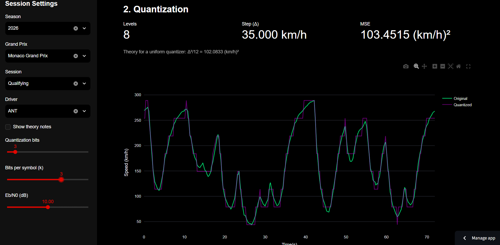
<p align="center"><sub>Fig. 9: Uniform quantization applied to the speed data.</sub></p>

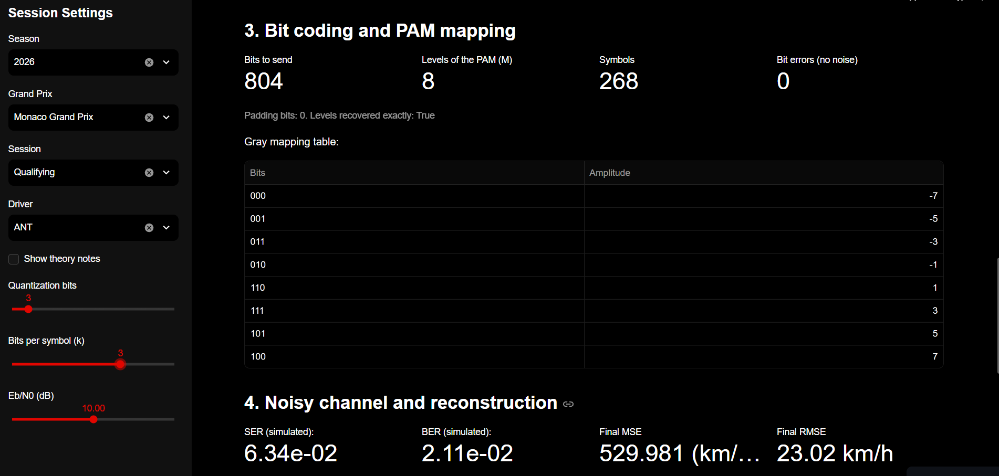
<p align="center"><sub>Fig. 10: Gray-coded mapping table for the M-PAM constellation.</sub></p>

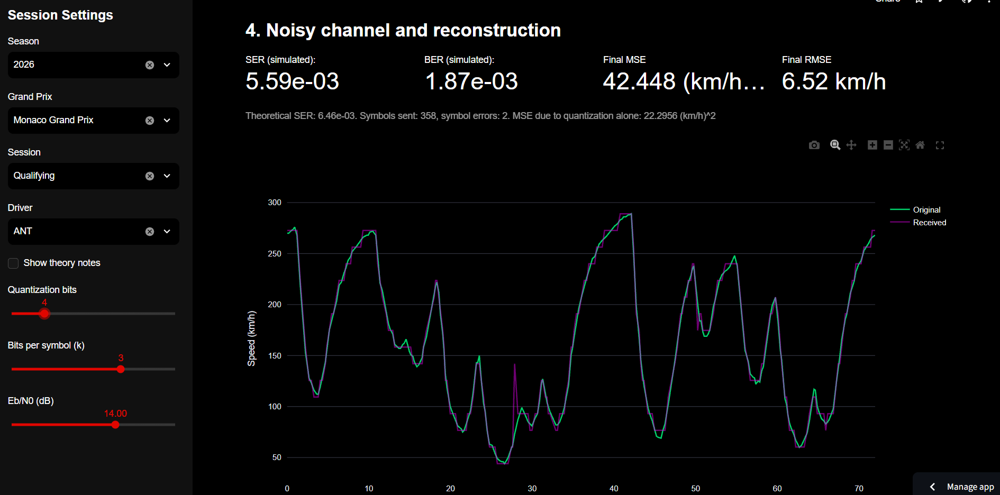
<p align="center"><sub>Fig. 11: Reconstructed signal comparison against the original, highlighting the final MSE and BER after AWGN channel transmission.</sub></p>

### 4. 🎯 Race Strategy Predictor (work in progress)

For four reference circuits (Hungaroring, Spa-Francorchamps, Suzuka and Marina Bay), the module estimates race strategies under green-flag conditions and compares two drivers lap by lap. It uses real FastF1 lap data; assumptions that cannot be estimated reliably from public data are exposed as sliders.

- Selects the latest available race and practice sessions for each circuit, and shows which sessions are used.
- Estimates green-flag pit stop loss as the median of valid stops, and displays valid and excluded stops.
- Estimates tyre degradation by compound, using race data when available and practice data as a fallback.
- Estimates a preliminary pace offset for each driver.
- Generates 1-stop and 2-stop strategies using at least two compounds. For each set of compounds, it keeps the fastest stint split and displays the result with a tyre-coloured bar chart.
- Compares two drivers using a selected strategy for each.

#### 📐 Formulas

**Lap time model** (`a` = tyre age, `n` = lap number, `d` = degradation, `k` = fuel effect):

$$t_{\mathrm{lap}} = t_{\mathrm{base}} + \Delta_{\mathrm{compound}} + d \cdot a - k \cdot n$$

**Pit stop loss**, calculated for each valid green-flag stop and summarized as the median:

$$L_{\mathrm{pit}} = t_{\mathrm{in-lap}} + t_{\mathrm{out-lap}} - 2\tilde{t}_{\mathrm{clean}}$$

where $\tilde{t}_{\mathrm{clean}}$ is the median clean lap time for that driver.

**Gap between drivers**, calculated lap by lap:

$$g_n = g_{n-1} + (t_{\mathrm{rival},n} - t_{\mathrm{driver},n})$$

A positive gap means the selected driver is ahead; a negative gap means the rival is ahead.

#### ✅ Example comparison

For Suzuka 2026, the simulated race time was 83:31.431, compared with the official winner's time of 1:28:03.403. This is an indicative comparison, not a direct validation: the simulation assumes green-flag running and does not reproduce all race conditions.

#### ⚠️ Known Limitations

- **Green-flag model:** Safety Cars, Virtual Safety Cars, red flags and rain are not simulated yet.
- **No traffic or overtaking model:** the selected starting position and gap set the initial conditions; the simulation does not model cars physically defending or passing each other.
- **Preliminary driver pace offsets:** offsets are estimated from observed race laps after tyre and fuel corrections. They may also reflect car performance, tyre choice, setup, traffic and race conditions, so they are not a pure measure of driver ability.
- **Simplified driver comparison:** both drivers are simulated under green-flag conditions using the selected strategies and initial gap.
- **Tyre cliff is manual:** the page shows an empirical wear curve, but does not detect the cliff automatically. The user can set what-if cliff parameters with the sidebar sliders.
- **Compound pace offsets** come from public Pirelli/F1 sources and are assumptions, not measurements.
- **Compound labels:** Soft, Medium and Hard refer to the weekend's assigned compounds, which can change between events and seasons.
- **Practice data:** practice laps can be affected by track evolution and different fuel loads, so they are used as a fallback.
- **Small samples:** some compounds have few stints, and the pit loss may rely on a limited number of green-flag stops.
- **Cross-season data:** when practice and race data come from different seasons, regulation changes may affect comparability.

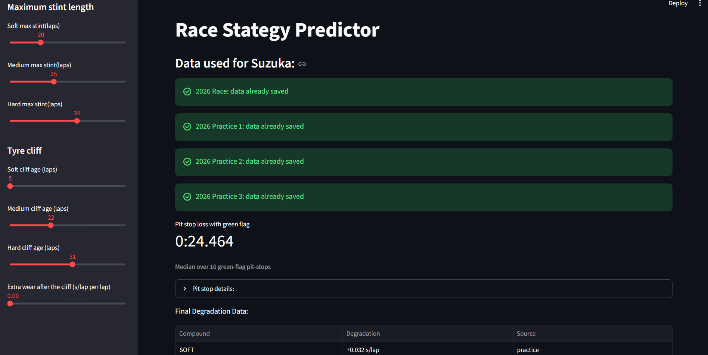
<p align="center"><sub>Fig. 12: Suzuka race strategy predictor.</sub></p>

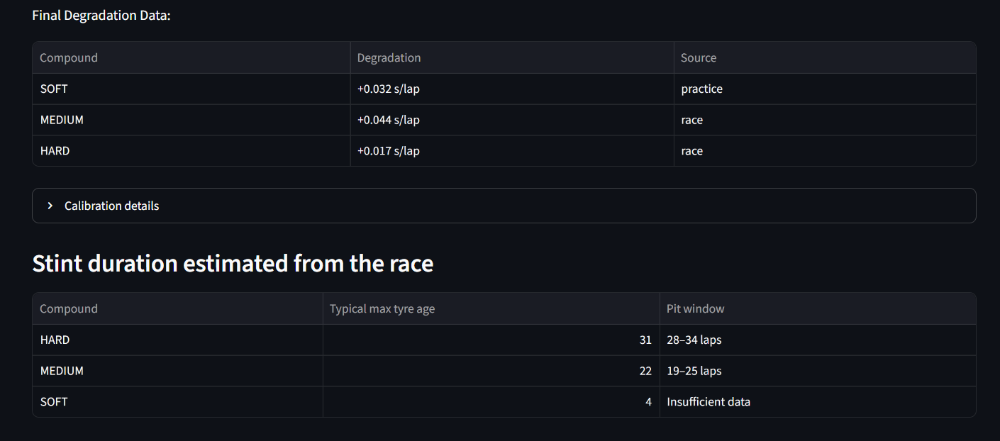
<p align="center"><sub>Fig. 13: Estimated degradation and stint duration.</sub></p>

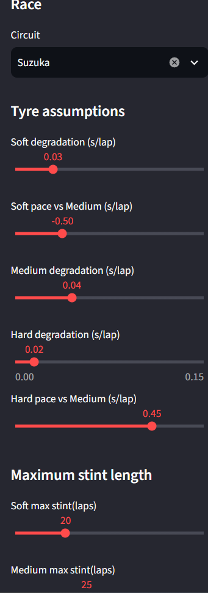
<p align="center"><sub>Fig. 14: Compound assumptions in the sidebar.</sub></p>

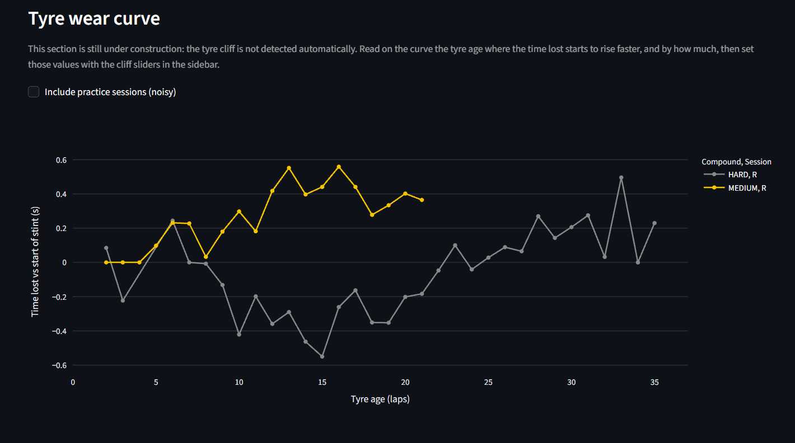
<p align="center"><sub>Fig. 15: Empirical tyre wear curve used to inspect potential cliff behaviour.</sub></p>

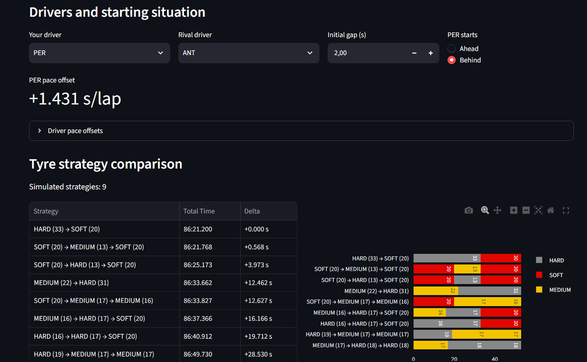
<p align="center"><sub>Fig. 16: Ranked strategies and tyre stint chart.</sub></p>

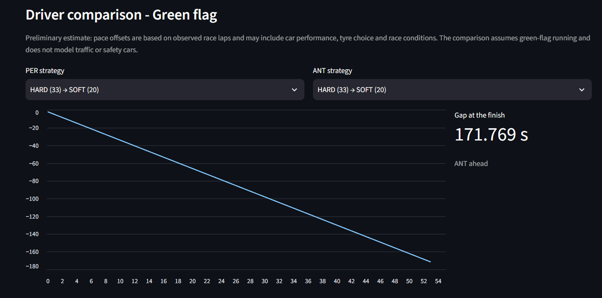
<p align="center"><sub>Fig. 17: Simulated lap-by-lap gap between two drivers.</sub></p>

---
## 🔮 Future Developments
* **Race Strategy Predictor — next steps:** pit stops under Safety Car / Virtual Safety Car, undercut/overcut analyzer, strategy-vs-strategy matrix, Monte Carlo simulation, backtest on a race not used in the calibration.

* **Noisy Radio — Level B:** compare bandpass PAM and QAM constellations, plot simulated vs. theoretical SER curves, and derive the required $E_b/N_0$ for a target SER to compare spectral and energy efficiency across modulation schemes.

---

## 💻 Tech Stack
* **Python 3**
* **Streamlit** (UI and Web Deployment)
* **FastF1** (F1 API Data Extraction)
* **Pandas & NumPy** (Data Manipulation & Grouping)
* **SciPy** (Signal Processing & Error Functions)
* **Plotly** (Interactive Data Visualization)

---

## 🚀 How to Run Locally

1. Clone this repository:
   ```bash
   git clone https://github.com/dlcbeatrix/f1_pitwall.git
   cd f1_pitwall
2. Create and activate a virtual environment:

   ```bash

   python -m venv venv

   venv\Scripts\activate

3. Install the dependencies:

   ```bash

   pip install -r requirements.txt

4. Run the Streamlit app: 

    ```bash

    streamlit run app.py


---

## 👤 Author

Developed by **dlcbeatrix**, Beatrice De Luca, *Computer Engineering Student*. 

